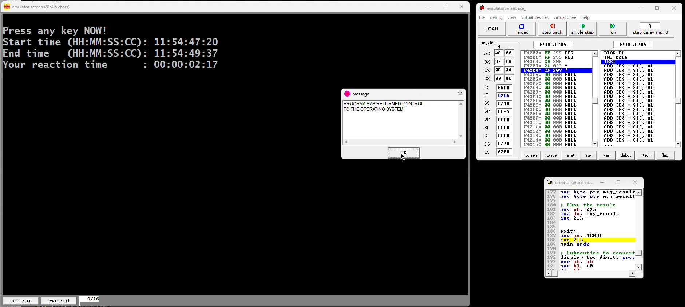

# ⚡ QuickReflex: Reaction Time Tracker in Assembly (EMU 8086)

[](./LICENSE)

**QuickReflex** is a powerful tool that challenges your reflexes by measuring your reaction time with centisecond precision. Developed entirely in **16-bit x86 Assembly**, it utilizes low-level BIOS interrupts to track time and user input, simulating how fast a human brain can respond to unexpected visual cues.



📽️ **Watch Demo**: [▶️ Click here to watch the demo video](./Video.mp4)

---

## 🚀 Features

- ⏱️ **Centisecond Precision**: Measures human reaction time down to 1/100th of a second.
- 🧠 **Cognitive Challenge**: Randomized delays ensure users cannot predict when to react.
- 🖥️ **Pure Assembly Code**: Crafted entirely using 8086 Assembly for educational and performance reasons.
- 📟 **BIOS Interrupt Mastery**: Uses `INT 1Ah` to directly access system clock ticks.
- 🧮 **Manual Time Difference Calculation**: Handles time subtraction with proper borrowing logic across time units.
- 🔁 **Replay Anytime**: Easily rerun the program to track improvement or demonstrate to others.
- 📊 **Educational Value**: A clean and well-commented source, perfect for learning how interrupts and timekeeping work in low-level programming.

---

## 🔧 Requirements

- ✅ **EMU8086** or any x86 emulator that supports BIOS interrupts.
- 🧰 **Operating System**: Windows recommended for EMU8086, or use DOSBox with FreeDOS for alternative platforms.
- 📚 **Assembly Language Knowledge**: Optional for running, essential for contributing or understanding the internals.

---

## 🧪 How It Works

1. Launch the program in **EMU8086**.
2. Press **Enter** to begin the test.
3. The program will show **"Wait for it..."** with a short randomized delay (~1.4 seconds).
4. Once **"Press any key NOW!"** appears, react immediately.
5. Your reaction time is calculated and displayed in the format:  
   `HH : MM : SS : CC` (Hours : Minutes : Seconds : Centiseconds)

### ⚙️ Behind the Scenes

- **Time Fetching**: `INT 1Ah` fetches the system clock before and after the reaction.
- **Delay**: Introduced using nested loops, not a fixed interval—keeps users alert.
- **Time Logic**: All four time units are subtracted manually with borrowing to ensure correct results even across boundaries (e.g., 59 to 00 seconds).

---

## 🗂️ File Structure

```
📁 QuickReflex/
├── main.asm        # Source code (Assembly)
├── video.mp4       # Demo video of the program
├── demo.png        # Screenshot of the output screen
├── LICENSE         # MIT License
└── README.md       # This file
```

---

## 🧑‍💻 Usage Guide

1. Open `main.asm` using **EMU8086 IDE**.
2. Click "Assemble and Link" to compile the code.
3. Click "Run" to execute it inside the emulator.
4. Follow the instructions printed in the console.
5. The reaction time will be shown once you hit a key after the signal.

---

## 🪪 License

This project is released under the [MIT License](./LICENSE).  
You're free to use, modify, distribute, or integrate this program into your own work.

---

## ⚖️ Contact

* 🔗 **GitHub**: [abdulrehmangulfaraz](https://github.com/abdulrehmangulfaraz)
* 🔗 **LinkedIn**: [abdulrehman-gulfaraz](https://www.linkedin.com/in/abdulrehman-gulfaraz)
* 📧 **Email**: [abdulrehmangulfaraz1@gmail.com](mailto:abdulrehmangulfaraz1@gmail.com)

---

## 🌟 Acknowledgements

Made with love and logic by **Abdulrehman**  
Crafted as a passion project to demonstrate how **Assembly language** can still be used to build fun and interactive software.

---

## 📣 Notes

- Feel free to clone this repo and tweak the logic for your own reflex-based experiments.
- For questions or enhancements, open an issue or reach out via LinkedIn.
- Ideal for CS students exploring **BIOS interrupts**, **real-time programming**, or **legacy architectures**.
